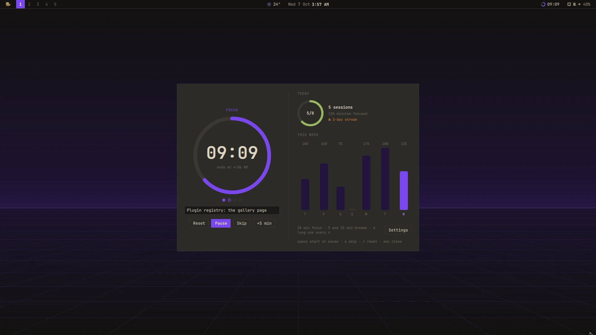

# Pomodoro

A plugin for [Mazapan](https://mazapan.dev), listed in its [plugin registry](https://mazapan.dev/plugins/pomodoro/).



Focus in sessions, with breaks between them: 25 minutes of focus, a short
break, again; after four, a long break. Every length is yours to set.

- **The timer**: a ring that fills as the time goes, the time left, when
  it ends, and the sessions of this set as dots. Start, pause, skip to the
  next phase, add five minutes, or start over.
- **What it's for**: write what you're working on; it stays with the
  timer.
- **Breaks that follow**: a break starts by itself when a session ends
  (or waits for you), and the next session waits for you after a break (or
  starts by itself). A sound and a notice say when each phase ends; the
  notice starts the next one when it waits.
- **Do Not Disturb while you focus**: other notifications wait until the
  session ends; the timer's own still come. A mode you set yourself is left
  as it is.
- **Today and the week**: sessions against your daily goal, minutes
  focused, the streak of days with a session, and the last seven days.
- **In the bar** a small ring and the time left (a right click starts or
  pauses); **in the Control Center**, the timer with its buttons.

`SUPER + ALT + P` opens it; in the palette, "Pomodoro" starts, pauses,
skips or starts over. In the panel: space starts and pauses, S skips, R
starts over, Esc closes.

The timer keeps when each phase ends, not a count: a reload of the shell or
a restart picks it up where it was. Sessions and minutes are kept by day in
`~/.local/state/mazapan/pomodoro.json`, on this computer only.

Its settings are read as they change: changing one doesn't reload the
shell, and a running session goes on.

## Install

In Mazapan, the Plugins panel (`SUPER + SHIFT + P`) lists it under the
community's: its page shows what it can do before you install it. Or:

```sh
mazapan plugins add pomodoro
mazapan apply
```

Updates come through the registry: `mazapan plugins update pomodoro`, or the
Updates panel, asking again only for anything new it would be able to do.

## Develop

```sh
git clone https://github.com/rick-dev-creator/mazapan-pomodoro
mazapan plugins dev mazapan-pomodoro     # applied again on every save
mazapan plugins check mazapan-pomodoro   # every theme, every language, before a release
```

A release is a tag, `vX.Y.Z`, the same as `version` in plugin.toml; the
registry lists it once it passes its checks.

## License

MIT
